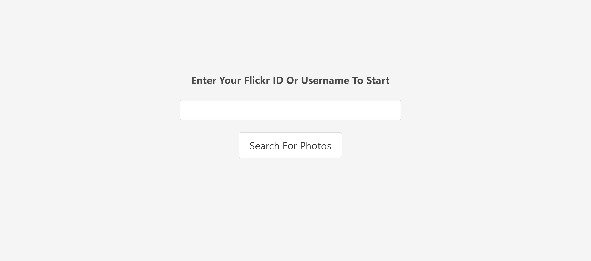

# Flickr API
## Description
This site is a toy app to set up use of the Flickr api to load the public photos of a given user. The project description can be found on [The Odin Project](https://www.theodinproject.com/paths/full-stack-ruby-on-rails/courses/ruby-on-rails/lessons/flickr-api). 

## Live Preview
A live version of this project can be found at [odin-flickr-api.herokuapp.com]](https://odin-flickr-api.herokuapp.com/)

## Functonality

You start with a simple search form where you can enter in either a user's Flickr username or user id number.

If the user can be found then the most recent public photos will be displayed. Each photo thumbail is a link to a larger version of the photo. There is also a button that will link to the user's Flickr profile page

## Resources Used
Listed here are the different external resources used to build this app

* [Ruby on Rails](https://rubyonrails.org/) - Web Application Framework
* [Bulma](https://bulma.io/) - CSS Framework used to structure the site
* [Figaro](https://github.com/laserlemon/figaro) - Ruby Gem used to add the api keys without pushing to Git
* [Flickr API](https://github.com/cyclotron3k/flickr) - Ruby Gem used to connect to the Flickr api within Rails
* [Heroku](heroku.com) - Site hosting
